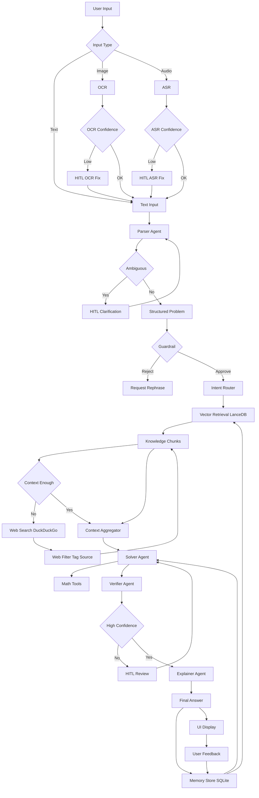

# Math Mentor AI

Multimodal AI math tutor: RAG, multi-agent system, human-in-the-loop (HITL), and memory. Solves JEE-level math from text, images, or audio with step-by-step explanations and continuous learning.

## Quick Start

### Prerequisites

- Python 3.10+
- API keys (at least one):
  - **OpenRouter** (Free models - Qwen3, GLM, DeepSeek): [openrouter.ai/keys](https://openrouter.ai/keys)
  - **Groq** (LLM + Whisper ASR): [console.groq.com/keys](https://console.groq.com/keys)
  - **Gemini** (LLM): [aistudio.google.com/app/apikey](https://aistudio.google.com/app/apikey)

### Install and run

```bash
git clone <your-repo-url>
cd code

python -m venv .venv

# Windows
.venv\Scripts\activate
# Linux/macOS
source .venv/bin/activate

pip install -r requirements.txt
cp .env.example .env
```

Edit `.env`:

```bash
OPENROUTER_API_KEY=your_openrouter_key  # For free models (optional)
GROQ_API_KEY=your_groq_key              # For Llama/Gemma + Whisper ASR
GEMINI_API_KEY=your_gemini_key          # For Gemini models (optional)
```

Run:

```bash
streamlit run main.py
```

App runs at `http://localhost:8501`. On first run it loads the knowledge base, then opens the UI.

---

## High-Level Design (HLD)

### Architecture overview

- **Model Selection**: User selects provider (OpenRouter/Groq/Gemini) and model in UI sidebar.
- **Input**: Text, image (OCR), or audio (ASR via Groq Whisper).
- **Guardrail**: Safety and scope (JEE-level math only).
- **Parser**: Raw input → structured problem; triggers HITL if ambiguous.
- **Router**: Topic classification (algebra, calculus, probability, linear algebra).
- **RAG**: LanceDB vector store + optional web search when context is insufficient.
- **Solver**: RAG context + SymPy tools → solution using selected model.
- **Verifier**: Correctness and confidence; triggers HITL if uncertain.
- **Explainer**: Student-friendly explanation using selected model.
- **Memory**: SQLite + embeddings; stores interactions and feedback for reuse.

### End-to-end flow (Mermaid)

This diagram is also in `flow.mmd`.



### HITL trigger points

| Trigger | Action |
|--------|--------|
| OCR confidence &lt; 70% | Review/edit extracted text before solving |
| ASR confidence &lt; 70% | Review/edit transcript before solving |
| Parser ambiguity | Clarification prompt; re-parse |
| Verifier uncertain or incorrect | Accept or reject solution before showing |
| User feedback | Thumbs up/down + optional comment; stored in memory |

---

## Features

- **Model selection**: 24 models across OpenRouter, Groq, Gemini providers (selectable in UI).
- **Multimodal input**: Text, image (EasyOCR), audio (Groq Whisper).
- **Agents**: Parser, Router, Solver, Verifier, Explainer, Guardrail, Web Search.
- **RAG**: 23 KB docs, LanceDB, sentence-transformers; DuckDuckGo fallback.
- **Memory**: SQLite + embeddings; similar-problem retrieval and pattern reuse.
- **Model fallback**: Automatic switching across all configured providers on rate limits.

---

## Usage

1. **Text**: Type the problem and click **Submit Problem**.
2. **Image**: Upload image → **Extract Text from Image** → review/edit → **Submit Problem**.
3. **Audio**: Record/upload → **Transcribe Audio** → review/edit → **Submit Problem**.

Use **Correct** / **Incorrect** (and optional comment) after each solution so the system can learn. Sidebar shows agent trace, session info, and memory stats (total, positive, negative feedback).

---

## Testing

- **Text**: e.g. "Solve x^2 - 5x + 6 = 0", "Find the derivative of x^3 + 2x".
- **HITL**: Blurry image (OCR), ambiguous text (Parser), low-confidence solution (Verifier).
- **Memory**: Solve a problem, then a similar one; check "Similar past problems" and stats.

---

## Troubleshooting

| Issue | Action |
|-------|--------|
| GROQ_API_KEY not found | Create `.env` from `.env.example` and set key |
| No text in image | Clearer image; use edit step after OCR |
| KB not loading | Ensure `rag/kb/` has `.txt` files; check `rag/tmp/lancedb` is writable |
| Agent/API errors | Check keys, network; use sidebar trace for details |

---

## Code style

- **PEP 8**: 4 spaces, 79-character line limit, blank lines between top-level definitions.
- **Naming**: `snake_case` (functions, variables), `PascalCase` (classes), `UPPER_CASE` (constants).
- **Docstrings**: Public modules, classes, and methods documented; comments kept minimal and up to date.
- **Resources**: `with` for file/DB usage; specific exceptions in `try`/`except`.

---

## License

This project is licensed under the MIT License.

## Link 

Demo Video : https://acesse.one/8pUAr

Link: https://huggingface.co/spaces/Rider786/Math-Tutor